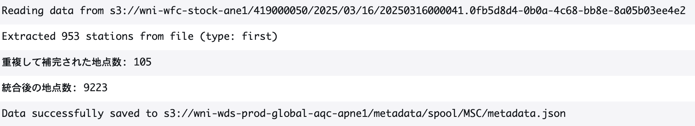
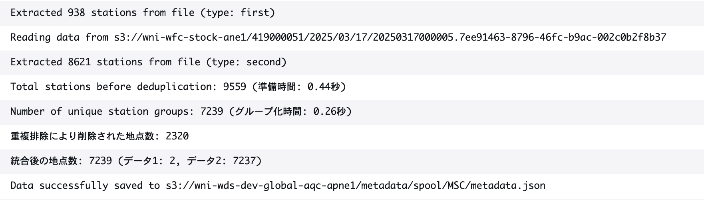
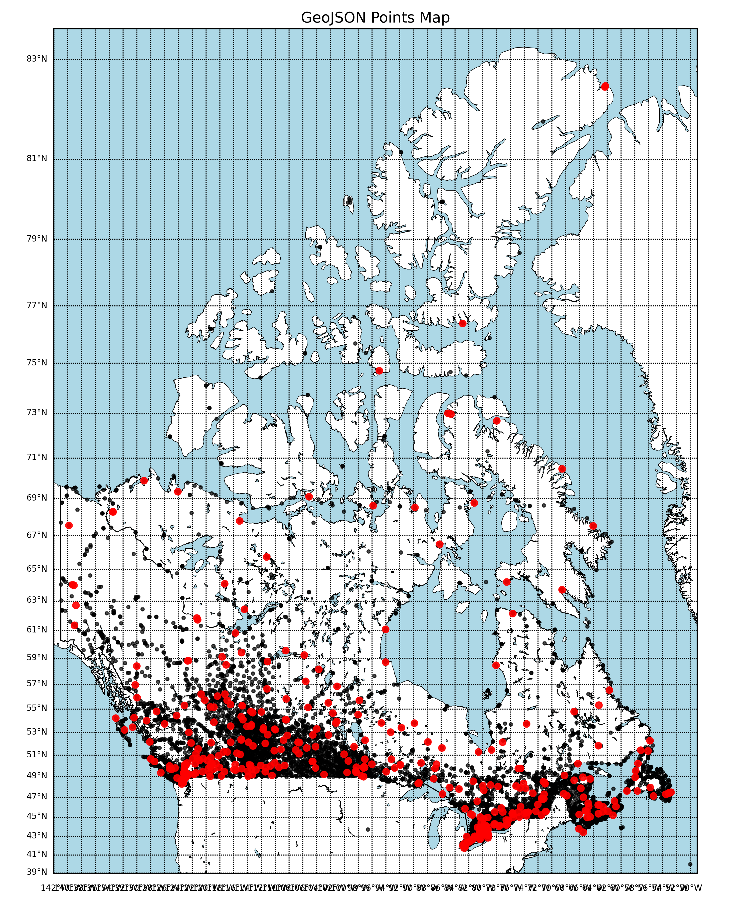
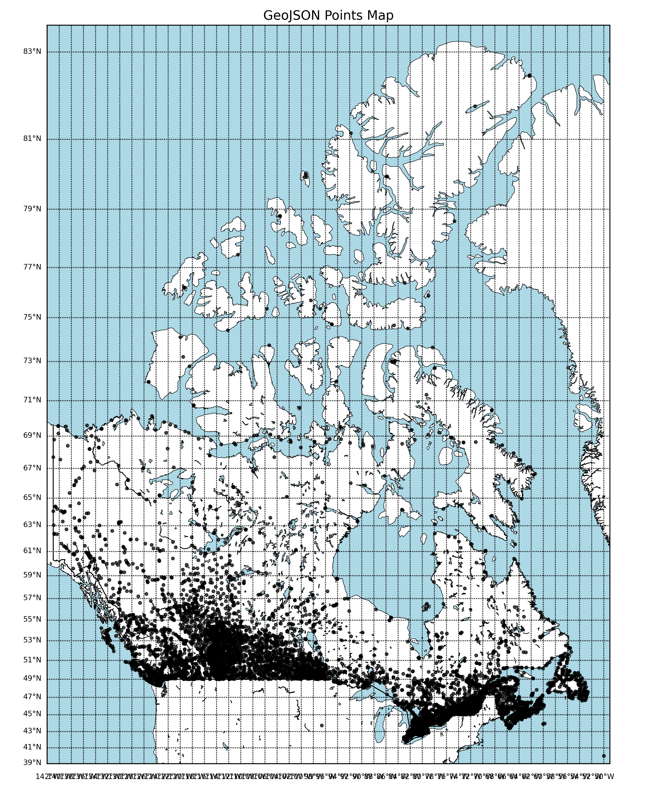

# **PSR レポート（2025/03/18）**

## **実施者**: 坂本壮  

## **Reviewer**: 瀬戸さん、畠中さん、栗原さん、石井さん

## **Tag ID**: 419000052  

## **コード名**: `MSC_TABLE_AWS_climate_METADB`  

## **データ名**: Canada MSC AWS Climate Point Table (from Metadata DB)  

## **GitHub**:
 [Pull Request　#147](https://github.com/weathernews/wds-obs-master-of-master-db/pull/147)  

---
## **背景**
前回のコードの重複排除ロジックが不十分であり、同じ `LCLID` を持つが `LNAME` が異なる地点がデータセットに残っていた。  

### **問題の例**
以下の2つのデータは、`LCLID: 1027403` が共通だが、`IATA` が異なるため、統合されずに別データとして残ってしまった。

#### **AWS 用データ**
```json
{
  "type": "Feature",
  "geometry": {
    "type": "Point",
    "coordinates": [
-124.43, 
49.49, 
20.0
]
  },
  "properties": {
    "LCLID": "1027403",
    "LNAME": "SISTERS ISLAND",
    "CNTRY": "CA",
    "WMO_ID": "71781",
    "IATA": "WGT"
  }
}

#### **climate 用データ**

{
  "type": "Feature",
  "geometry": {
    "type": "Point",
    "coordinates": [
-124.43487, 
49.486437
]
  },
  "properties": {
    "LCLID": "1027403",
    "LNAME": "SISTERS ISLAND",
    "CNTRY": "CA",
    "WMO_ID": "71781",
    "IATA": "CWGT"
  }
}

```
## **旧コード**
### **処理の流れ**
1. **`Station Name + 緯度 + 経度` をキーにする**
2. **既にあるキーなら、空のデータを後から埋める**
3. **キーがない場合、新規登録**
4. **辞書の値をリスト化して返す**

### **問題点**
- **`Station Name + 緯度 + 経度`がセット** → 緯度経度が同じでもNameが異なれば残る  


---

## **新コード**
### **処理の流れ**
1. **`LCLID（ID）・Station Name・座標`のそれぞれを重複判定の対象にする**
2. **地点の重複があった場合、優先度を決め、それが高いデータのみを残す**
   - **標高データ（`Elevation`）がある方を優先**
   - **空でないフィールドが多い方を優先**

### **メリット**
- **データの質を考慮して最適なものを選択**  
- **間違った統合を防ぐ（異なるステーションが混ざらない）**

### **その他変更事項**
- **IATAが、カナダの独自企画だったため、この改修時に除ました。**  
---


## **変更なしの項目**
以下の設定ファイルは、前回のPSRから変更なし：
- `cost`
- `リリース手順`
- `template.yaml`
- `samconfig.toml`
- `buildspec.yaml`

------

## **試験**
### **試験目的**
- **変化前と比べて、重複した地点がなくなっているかを確認**


### **試験結果**
- **元々のログ**

- 地点数が9223, 重複排除が105地点


- **新しいログ**

- 地点数が7239, 重複排除が2320地点

- **元々のコードでの地図**

-赤色は重複地点

- **新しいコードでの地図**

-赤色がない


---

## **感想**
デンマークでの重複は、「**複数回同じ地点が出てくることを想定していなかった**」ために発生したが、  
今回は「**同じ地点が別の名前で登録されることを想定していなかった**」ために発生した。

PSRが遅れてしまったが、この **重複排除ロジックは既にエストニアの地点データ取得の際にも活用** している。  
今後のデータ取得・フォーマット調整の際の **基準として活用できるように整備していく予定** である。
